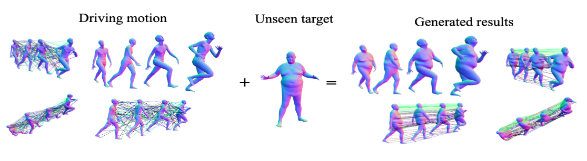

Code for our NeurIPS 2023 paper "[LART: Neural Correspondence Learning with Latent Regularization Transformer for 3D Motion Transfer](https://openreview.net/pdf?id=g27BggUT3L)"

# LART
This is the PyTorch implementation of our NeurIPS 2023 paper LART: Neural Correspondence Learning with Latent Regularization Transformer for 3D Motion Transfer.
[Haoyu Chen](https://scholar.google.com/citations?user=QgbraMIAAAAJ&hl=en), [Hao Tang](https://github.com/Ha0Tang), [Radu Timofte](https://scholar.google.be/citations?user=u3MwH5kAAAAJ&hl=en), [Luc Van Gool](https://scholar.google.be/citations?user=TwMib_QAAAAJ&hl=en), [Guoying Zhao](https://scholar.google.com/citations?user=hzywrFMAAAAJ&hl=en). <br>



#### Citation

If you use our code or paper, please consider citing:
```
@inproceedings{chen2023LART,
  title={LART: Neural Correspondence Learning with Latent Regularization Transformer for 3D Motion Transfer},
  author={Chen, Haoyu and Tang, Hao and Timofte, Radu and Van Gool, Luc and Zhao, Guoying},
  booktitle={NeurIPS},
  year={2023}
}
```

## Code
We are still organizing the code; please bear with us for a while.

## Acknowledgement
Part of our code is based on 

3D transfer: [NPT](https://github.com/jiashunwang/Neural-Pose-Transfer)，

and inspired by:

3D transfer with Correspondence Learning: [3DCorNet](https://github.com/ChaoyueSong/3d-corenet)，

Transformer framework: (https://github.com/lucidrains/vit-pytorch) 

Many thanks!

## License
MIT-2.0 License
